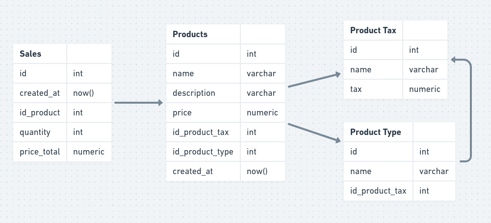

# Sistema de Mercado

Projeto desenvolvido com o intuito de resolver o desafio técnico de PHP para a empresa SoftExpert.

## Pré-Requisitos

- PHP 8.\*;
- Composer
- PostgresSQL

## Tecnologias Utilizadas

- Slim Framework 4 - Utilizado somente para controle de rotas;
- PHP-DI - Container de Injeção de Dependência;
- PHPDotEnv - Usando para declarar variaveis de ambiente no arquivo .env;
- PHPUnit - Usando para realização dos testes;

## Passos iniciais

- Clone o repositorio e entre na pasta gerada;
- Instale as dependências do PHP com o comando `composer install`;
- Crie um banco de dados chamado "mercado_softexpert";
- Execute o backup do banco de dados com o arquivo **bd.backup** encontrado na raiz do projeto;
- Caso tenha problemas com o arquivo backup do banco, utilize o arquivo **dump.sql** encontrado na raiz do projeto;
- Encontre o arquivo **.env.example** na raiz do projeto e renomeio para **.env**, em seguida adicione as configurações do seu banco postgreSQL instalado em sua máquina;
- Após as configurações do banco, inicie o servidor embutido do PHP com o comando `php -S localhost:8080`;
- Caso queira executar a aplicação com a interface no front-end, abra outro terminal e execute o comando `php -S localhost:8000 -t public`;
- O projeto web estará disponível em `http://localhost:8000`;

## Regras de Negócio



O projeto permite realizar as seguintes operações:

- Listar todos os produtos;
- Adicionar um novo produto;
- Adicionar um novo tipo de produto;
- Adicionar um novo imposto para o tipo de produto;
- Adicionar uma venda com a quantidade e preço para cada produto;
- Listar todas as vendas mais recentes;
- Visualizar algumas métricas (Rendimento Total, Total de Vendas, Total de Produtos e Ticket Médio);
- Listar a quantidade de vendas por dia;

## Endpoits

`GET /products`

```json
[
    {
        "id": 1,
        "name": "Product 1",
        "description": "Produto 1",
        "price": "29.90",
        "productTypeName": "Livro",
        "taxName": "ISS",
        "tax": "0.075"
    },
    ...
]
```

### Descrição

Retorna uma lista de todos os produtos cadastrados

---

`POST /products/store`

```json
// Body params
{
  "name": "Product",
  "description": "Product 1",
  "price": "29.90",
  "typeId": 1,
  "taxId": 1
}
```

```json
{
  "message": "Product created successfully",
  "status": "success"
}
```

### Descrição

Retorna um json com uma mensagem de sucesso ou de erro.

---

`GET /products/tax`

```json
[
    {
        "id": 1,
        "name": "ISS",
        "tax": "0.075"
    },
    {
        "id": 2,
        "name": "FIS",
        "tax": "0.1"
    },
    ...
]
```

### Descrição

Retorna uma lista contendo todas os impostos criados.

`POST /products/tax/store`

```json
// Body params
{
  "name": "INSS",
  "tax": 0.25
}
```

```json
{
  "message": "Product tax created successfully",
  "status": "success"
}
```

### Descrição

Retorna um json com uma mensagem de sucesso ou de erro.

---

`GET /products/types`

```json
[
    {
        "id": 1,
        "name": "Eletrônicos",
        "tax_id": 10,
        "tax_name": "ICMS",
        "tax": "0.2"
    },
    {
        "id": 2,
        "name": "Roupas",
        "tax_id": 12,
        "tax_name": "IPI",
        "tax": "0.28"
    },
    ...
]
```

### Descrição

Retorna uma lista contendo todos os tipos de produto com o imposto aplicado.

---

`POST /products/types/store`

```json
// Body params
{
  "name": "INSS",
  "taxId": 1
}
```

```json
{
  "message": "Product type created successfully",
  "status": "success"
}
```

### Descrição

Retorna um json com uma mensagem de sucesso ou de erro.

---

`GET /products/sales`

```json
[
    {
        "id": 1,
        "created_at": "2024-03-01 00:00:00",
        "id_product": 5,
        "quantity": 2,
        "price_total": "100.00"
    },
     {
        "id": 2,
        "created_at": "2024-03-04 00:00:00",
        "id_product": 8,
        "quantity": 3,
        "price_total": "600.00"
    },
    ...
]
```

### Descrição

Retorna uma lista contendo todas as vendas.

---

`GET /products/sales/recent`

```json
[
  {
    "id": 1,
    "name": "CD",
    "productType": "Livros",
    "quantity": 2,
    "price": "100.00"
  },
  {
    "id": 1,
    "name": "Blusa",
    "productType": "Roupas",
    "quantity": 2,
    "price": "80.00"
  },
  ...
]
```

### Descrição

Retorna uma lista contendo todas as últimas vendas.

---

`GET /products/sales/metrics`

```json
{
  "totalRevenue": 7197.32,
  "totalSales": 20,
  "totalProducts": 20,
  "averageTicket": 359.75
}
```

### Descrição

Retorna um JSON contendo os valores de algumas métricas como "Total de Rendimento", "Total de Vendas", "Total de Produtos Cadastrado" e "Ticket Médio do Total de Rendimento".

---

`GET /products/sales/sales-by-day`

```json
[
  {
    "quantity": 3,
    "date": "2024-03-01",
  },
  {
    "quantity": 53,
    "date": "2024-03-02",
  }
  ...
]
```

### Descrição

Retorna uma lista contendo o volume de vendas por dia, usado especificamente para a visão gráfica.

---

`POST /products/sales/store`

```json
// Body params
[
  {
    "productId": 2,
    "quantity": 1,
    "priceTotal": 100.23
  },
  {
    "productId": 4,
    "quantity": 3,
    "priceTotal": 600
  },
  ...
]
```

```json
{
  "message": "Sales created",
  "status": "success"
}
```

### Descrição

Retorna um json com uma mensagem de sucesso ou de erro.

## Testes

O projeto inclui testes automatizados para garantir a qualidade do código, onde foi utilizado o framework PHPUnit para execução dos testes.

Para executar os testes, execute o comando `vendor/bin/phpunit` na raiz do projeto.

### Tests\Repositories\InMemoryProductTaxRepositoryTest

<details>
  <summary>testFindAll()</summary>

Testa se a função **FindAll()** está retornando um array contendo uma lista de objetos de ProductTax.

</details>

<details>
  <summary>testCreateProductTax()</summary>

Testa se a função **create()** consegue criar um ProductTax, retornando um booleano, do qual sendo verdadeiro para a criação e falso caso não consiga criar.

</details>

### Tests\Repositories\InMemoryProductTypeRepositoryTest

<details>
  <summary>testFindAll()</summary>

Testa se a função **findAll()** está retornando um array contendo uma lista de objetos de ProductType.

</details>

<details>
  <summary>testCreateProductType()</summary>

Testa se a função **create()** consegue criar um ProductType, retornando um booleano, do qual sendo verdadeiro para a criação e falso caso não consiga criar.

</details>

### Tests\Repositories\InMemoryProductRepositoryTest

<details>
  <summary>testFindByAll()</summary>

Testa se a função **findByAll()** está retornando um array contendo uma lista de objetos de Product.

</details>

<details>
  <summary>testIfGetTotalProducts()</summary>

Testa se a função **getTotalProducts()** está retornando um valor inteiro contendo o total de produtos cadastrados.

</details>

<details>
  <summary>testCreateProduct()</summary>

Testa se a função **create()** consegue criar um Product, retornando um booleano, do qual sendo verdadeiro para a criação e falso caso não consiga criar.

</details>

### Tests\Repositories\InMemorySalesRepositoryTest

<details>
  <summary>testIfReturnAllSales()</summary>

Testa se a função **getAllSales()** está retornando um array contendo uma lista de objetos de Sale.

</details>

<details>
  <summary>testIfReturnAllRecentSales()</summary>

Testa se a função **getAllRecentSales()** está retornando um array contendo uma lista de objetos de Sale ordenada pelo mais recente.

</details>

<details>
  <summary>testIfGetTotalRevenueReturnsSumOfSales()</summary>

Testa se a função **getTotalRevenue()** está retornando o valor total de vendas.

</details>

<details>
  <summary>testIfGetTotalSalesReturnsNumberOfSales()</summary>

Testa se a função **getTotalSales()** está retornando a quantidade total de vendas.

</details>

<details>
  <summary>testIfGetAverageTicketReturnsAverageTicket()</summary>

Testa se a função **getAverageTicket()** está retornando o ticket médio de todas as vendas cadastradas.

</details>

<details>
  <summary>testGetSalesVolumePerDayReturnsSalesPerDay()</summary>

Testa se a função **getSalesVolumePerDay()** está retornando um array contendo a quantidade de vendas por dia.

</details>

<details>
  <summary>testCreateSale()</summary>

Testa se a função **create()** consegue criar um array de Sales, retornando um booleano, do qual sendo verdadeiro para a criação e falso caso não consiga criar.

</details>
